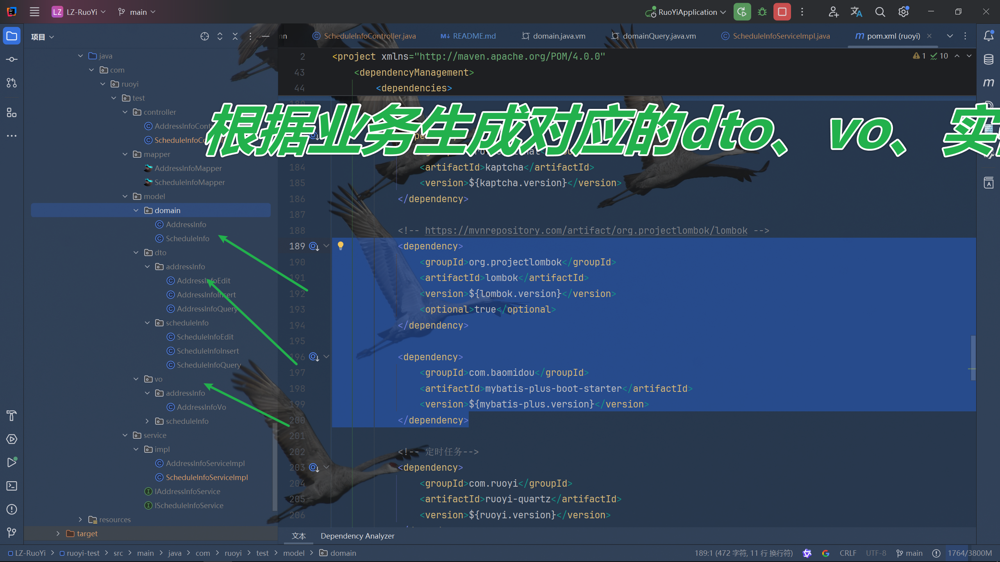
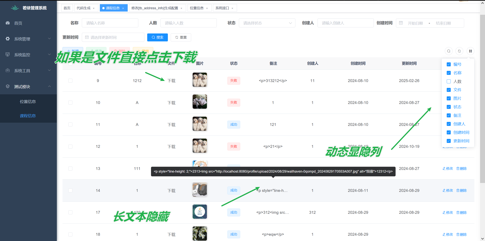
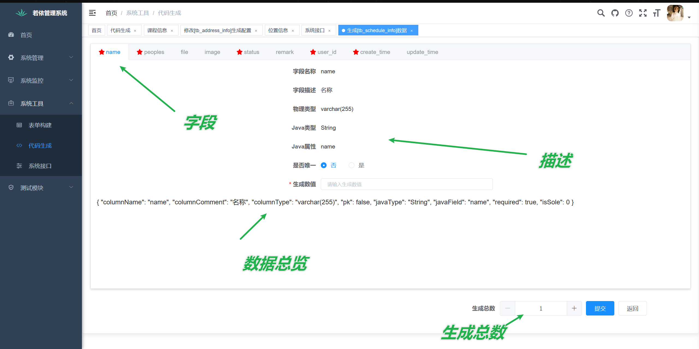

<p align="center">
	
</p>
<h1 align="center" style="margin: 30px 0 30px; font-weight: bold;">app v3.8.9</h1>
<h4 align="center">基于SpringBoot+Vue前后端分离的Java快速开发框架</h4>
<p align="center">
	<a href="https://gitee.com/y_project/RuoYi-Vue/stargazers"></a>
	<a href="https://gitee.com/y_project/RuoYi-Vue"></a>
	<a href="https://gitee.com/y_project/app-Vue/blob/master/LICENSE"></a>
</p>


## 介绍地址

B站 https://www.bilibili.com/video/BV15V9AYgEvL/?share_source=copy_web&vd_source=a4c1f9a58f1a8dd2e581c0f88e037fca

抖音 https://v.douyin.com/i5jgjvss/ 


## 增加功能

在不影响若依原本功能基础上，集成mybatisPlus、lombok、数据批量插入、优化前端代码生成

1. 集成mybatisPlus 3.5.9
2. 集成lombok 1.18.24
3. 根据lombok、mybatisPlus与业务生成对应的dto和vo
4. 生成lombok和mybatisPlus的代码
5. 优化web前端生成，如果是文件类型生成的代码列表可以直接下载，动态显隐列，长文本内容可以隐藏
6. 批量生成数据

### 集成mybatisPlus 3.5.9与lombok 1.18.24

```xml
        <lombok.version>1.18.24</lombok.version>
        <mybatis-plus.version>3.5.9</mybatis-plus.version>
```

```xml
            <dependency>
                <groupId>org.projectlombok</groupId>
                <artifactId>lombok</artifactId>
                <version>${lombok.version}</version>
                <optional>true</optional>
            </dependency>

            <dependency>
                <groupId>com.baomidou</groupId>
                <artifactId>mybatis-plus-boot-starter</artifactId>
                <version>${mybatis-plus.version}</version>
            </dependency>
```

### 根据lombok、mybatisPlus与业务生成对应的dto和vo



**实体**

```java
package com.app.test.model.domain;

import java.io.Serializable;
import java.util.Map;
import java.util.Date;
import com.fasterxml.jackson.annotation.JsonFormat;
import com.baomidou.mybatisplus.annotation.IdType;
import com.baomidou.mybatisplus.annotation.TableId;
import com.baomidou.mybatisplus.annotation.TableField;
import com.baomidou.mybatisplus.annotation.TableName;
import lombok.Data;
import com.app.common.annotation.Excel;
import com.fasterxml.jackson.annotation.JsonInclude;
/**
 * 位置信息对象 tb_address_info
 *
 * @author app
 * @date 2025-02-27
 */
@TableName("tb_address_info")
@Data
public class AddressInfo implements Serializable
{
    private static final long serialVersionUID = 1L;

    /** 编号 */
    @Excel(name = "编号")
    @TableId(value = "id", type = IdType.ASSIGN_ID)
    private Long id;

    /** 父级编号 */
    @Excel(name = "父级编号")
    private Long parentId;

    /** 位置名称 */
    @Excel(name = "位置名称")
    private String name;

    /** 类型 */
    @Excel(name = "类型")
    private String addressType;

    /** 图片 */
    @Excel(name = "图片")
    private String imageInfo;

    /** 文件 */
    @Excel(name = "文件")
    private String fileInfo;

    /** 备注 */
    @Excel(name = "备注")
    private String remark;

    /** 状态 */
    @Excel(name = "状态")
    private String status;

    /** 创建人 */
    @Excel(name = "创建人")
    private Long userId;

    /** 创建时间 */
    @JsonFormat(pattern = "yyyy-MM-dd")
    @Excel(name = "创建时间", width = 30, dateFormat = "yyyy-MM-dd")
    private Date createTime;

    /** 更新时间 */
    @JsonFormat(pattern = "yyyy-MM-dd")
    @Excel(name = "更新时间", width = 30, dateFormat = "yyyy-MM-dd")
    private Date updateTime;

    /** 请求参数 */
    @JsonInclude(JsonInclude.Include.NON_EMPTY)
    @TableField(exist = false)
    private Map<String, Object> params;
}

```

**VO** 

```java
package com.app.test.model.vo.addressInfo;

import java.io.Serializable;
import java.util.Date;
import com.fasterxml.jackson.annotation.JsonFormat;
import lombok.Data;
import com.app.common.annotation.Excel;
import org.springframework.beans.BeanUtils;
import com.app.test.model.domain.AddressInfo;
/**
 * 位置信息Vo对象 tb_address_info
 *
 * @author app
 * @date 2025-02-27
 */
@Data
public class AddressInfoVo implements Serializable
{
    private static final long serialVersionUID = 1L;

    /** 编号 */
    @Excel(name = "编号")
    private Long id;

    /** 父级编号 */
    @Excel(name = "父级编号")
    private Long parentId;

    /** 位置名称 */
    @Excel(name = "位置名称")
    private String name;

    /** 类型 */
    @Excel(name = "类型")
    private String addressType;

    /** 图片 */
    @Excel(name = "图片")
    private String imageInfo;

    /** 文件 */
    @Excel(name = "文件")
    private String fileInfo;

    /** 备注 */
    @Excel(name = "备注")
    private String remark;

    /** 状态 */
    @Excel(name = "状态")
    private String status;

    /** 创建人 */
    @Excel(name = "创建人")
    private Long userId;

    /** 创建时间 */
    @JsonFormat(pattern = "yyyy-MM-dd")
    @Excel(name = "创建时间", width = 30, dateFormat = "yyyy-MM-dd")
    private Date createTime;

    /** 更新时间 */
    @JsonFormat(pattern = "yyyy-MM-dd")
    @Excel(name = "更新时间", width = 30, dateFormat = "yyyy-MM-dd")
    private Date updateTime;


 /**
 * 对象转封装类
 *
 * @param addressInfo AddressInfo实体对象
 * @return AddressInfoVo
 */
    public static AddressInfoVo objToVo(AddressInfo addressInfo) {
        if (addressInfo == null) {
            return null;
        }
        AddressInfoVo addressInfoVo = new AddressInfoVo();
        BeanUtils.copyProperties(addressInfo, addressInfoVo);
        return addressInfoVo;
    }
}

```

**编辑DTO**

```java
package com.app.test.model.dto.addressInfo;

import java.io.Serializable;
import java.util.Date;
import com.fasterxml.jackson.annotation.JsonFormat;
import lombok.Data;
import org.springframework.beans.BeanUtils;
import com.app.test.model.domain.AddressInfo;
/**
 * 位置信息Vo对象 tb_address_info
 *
 * @author app
 * @date 2025-02-27
 */
@Data
public class AddressInfoEdit implements Serializable
{
    private static final long serialVersionUID = 1L;

    /** 编号 */
    private Long id;

    /** 父级编号 */
    private Long parentId;

    /** 位置名称 */
    private String name;

    /** 类型 */
    private String addressType;

    /** 图片 */
    private String imageInfo;

    /** 文件 */
    private String fileInfo;

    /** 备注 */
    private String remark;

    /** 状态 */
    private String status;

    /** 创建人 */
    private Long userId;

    /**
     * 对象转封装类
     *
     * @param addressInfoEdit 编辑对象
     * @return AddressInfo
     */
    public static AddressInfo editToObj(AddressInfoEdit addressInfoEdit) {
        if (addressInfoEdit == null) {
            return null;
        }
        AddressInfo addressInfo = new AddressInfo();
        BeanUtils.copyProperties(addressInfoEdit, addressInfo);
        return addressInfo;
    }
}
```

**插入DTO**

```java
package com.app.test.model.dto.addressInfo;

import java.io.Serializable;
import java.util.Date;
import com.fasterxml.jackson.annotation.JsonFormat;
import lombok.Data;
import org.springframework.beans.BeanUtils;
import com.app.test.model.domain.AddressInfo;
/**
 * 位置信息Vo对象 tb_address_info
 *
 * @author app
 * @date 2025-02-27
 */
@Data
public class AddressInfoInsert implements Serializable
{
    private static final long serialVersionUID = 1L;

    /** 编号 */
    private Long id;

    /** 父级编号 */
    private Long parentId;

    /** 位置名称 */
    private String name;

    /** 类型 */
    private String addressType;

    /** 图片 */
    private String imageInfo;

    /** 文件 */
    private String fileInfo;

    /** 备注 */
    private String remark;

    /** 状态 */
    private String status;

    /** 创建人 */
    private Long userId;

    /**
     * 对象转封装类
     *
     * @param addressInfoInsert 插入对象
     * @return AddressInfoInsert
     */
    public static AddressInfo insertToObj(AddressInfoInsert addressInfoInsert) {
        if (addressInfoInsert == null) {
            return null;
        }
        AddressInfo addressInfo = new AddressInfo();
        BeanUtils.copyProperties(addressInfoInsert, addressInfo);
        return addressInfo;
    }
}

```

**查询DTO**

```java
package com.app.test.model.dto.addressInfo;

import java.util.Map;
import java.io.Serializable;
import java.util.Date;
import com.fasterxml.jackson.annotation.JsonFormat;
import lombok.Data;
import com.fasterxml.jackson.annotation.JsonInclude;
import org.springframework.beans.BeanUtils;
import com.fasterxml.jackson.annotation.JsonFormat;
import com.baomidou.mybatisplus.annotation.TableField;
import com.app.test.model.domain.AddressInfo;
/**
 * 位置信息Query对象 tb_address_info
 *
 * @author app
 * @date 2025-02-27
 */
@Data
public class AddressInfoQuery implements Serializable
{
    private static final long serialVersionUID = 1L;

    /** 父级编号 */
    private Long parentId;

    /** 位置名称 */
    private String name;

    /** 类型 */
    private String addressType;

    /** 状态 */
    private String status;

    /** 创建人 */
    private Long userId;

    /** 创建时间 */
    @JsonFormat(pattern = "yyyy-MM-dd")
    private Date createTime;

    /** 更新时间 */
    @JsonFormat(pattern = "yyyy-MM-dd")
    private Date updateTime;

    /** 请求参数 */
    @JsonInclude(JsonInclude.Include.NON_EMPTY)
    @TableField(exist = false)
    private Map<String, Object> params;

    /**
     * 对象转封装类
     *
     * @param addressInfoQuery 查询对象
     * @return AddressInfo
     */
    public static AddressInfo queryToObj(AddressInfoQuery addressInfoQuery) {
        if (addressInfoQuery == null) {
            return null;
        }
        AddressInfo addressInfo = new AddressInfo();
        BeanUtils.copyProperties(addressInfoQuery, addressInfo);
        return addressInfo;
    }
}

```

### 前端页面优化展示



### 批量插入



## 平台简介

若依是一套全部开源的快速开发平台，毫无保留给个人及企业免费使用。

* 前端采用Vue、Element UI。
* 后端采用Spring Boot、Spring Security、Redis & Jwt。
* 权限认证使用Jwt，支持多终端认证系统。
* 支持加载动态权限菜单，多方式轻松权限控制。
* 高效率开发，使用代码生成器可以一键生成前后端代码。
* 提供了技术栈（[Vue3](https://v3.cn.vuejs.org) [Element Plus](https://element-plus.org/zh-CN) [Vite](https://cn.vitejs.dev)）版本[app-Vue3](https://gitcode.com/yangzongzhuan/app-Vue3)，保持同步更新。
* 提供了单应用版本[app-Vue-fast](https://gitcode.com/yangzongzhuan/app-Vue-fast)，Oracle版本[app-Vue-Oracle](https://gitcode.com/yangzongzhuan/app-Vue-Oracle)，保持同步更新。
* 不分离版本，请移步[app](https://gitee.com/y_project/app)，微服务版本，请移步[app-Cloud](https://gitee.com/y_project/app-Cloud)
* 阿里云折扣场：[点我进入](http://aly.app.vip)，腾讯云秒杀场：[点我进入](http://txy.app.vip)&nbsp;&nbsp;

## 内置功能

1.  用户管理：用户是系统操作者，该功能主要完成系统用户配置。
2.  部门管理：配置系统组织机构（公司、部门、小组），树结构展现支持数据权限。
3.  岗位管理：配置系统用户所属担任职务。
4.  菜单管理：配置系统菜单，操作权限，按钮权限标识等。
5.  角色管理：角色菜单权限分配、设置角色按机构进行数据范围权限划分。
6.  字典管理：对系统中经常使用的一些较为固定的数据进行维护。
7.  参数管理：对系统动态配置常用参数。
8.  通知公告：系统通知公告信息发布维护。
9.  操作日志：系统正常操作日志记录和查询；系统异常信息日志记录和查询。
10. 登录日志：系统登录日志记录查询包含登录异常。
11. 在线用户：当前系统中活跃用户状态监控。
12. 定时任务：在线（添加、修改、删除)任务调度包含执行结果日志。
13. 代码生成：前后端代码的生成（java、html、xml、sql）支持CRUD下载 。
14. 系统接口：根据业务代码自动生成相关的api接口文档。
15. 服务监控：监视当前系统CPU、内存、磁盘、堆栈等相关信息。
16. 缓存监控：对系统的缓存信息查询，命令统计等。
17. 在线构建器：拖动表单元素生成相应的HTML代码。
18. 连接池监视：监视当前系统数据库连接池状态，可进行分析SQL找出系统性能瓶颈。

## 在线体验

- admin/admin123  
- 陆陆续续收到一些打赏，为了更好的体验已用于演示服务器升级。谢谢各位小伙伴。

演示地址：http://vue.ruoyi.vip  
文档地址：http://doc.ruoyi.vip

## 演示图

<table>
    <tr>
        <td></td>
        <td></td>
    </tr>
    <tr>
        <td></td>
        <td></td>
    </tr>
    <tr>
        <td></td>
        <td></td>
    </tr>
	<tr>
        <td></td>
        <td></td>
    </tr>	 
    <tr>
        <td></td>
        <td></td>
    </tr>
	<tr>
        <td></td>
        <td></td>
    </tr>
	<tr>
        <td></td>
        <td></td>
    </tr>
    <tr>
        <td></td>
        <td></td>
    </tr>
</table>


## 若依前后端分离交流群

QQ群： [](https://jq.qq.com/?_wv=1027&k=5bVB1og) [](https://jq.qq.com/?_wv=1027&k=5eiA4DH) [](https://jq.qq.com/?_wv=1027&k=5AxMKlC) [](https://jq.qq.com/?_wv=1027&k=51G72yr) [](https://jq.qq.com/?_wv=1027&k=VvjN2nvu) [](https://jq.qq.com/?_wv=1027&k=5vYAqA05) [](https://jq.qq.com/?_wv=1027&k=kOIINEb5) [](https://jq.qq.com/?_wv=1027&k=UKtX5jhs) [](https://jq.qq.com/?_wv=1027&k=EI9an8lJ) [](https://jq.qq.com/?_wv=1027&k=SWCtLnMz) [](https://jq.qq.com/?_wv=1027&k=96Dkdq0k) [](https://jq.qq.com/?_wv=1027&k=0fsNiYZt) [](https://jq.qq.com/?_wv=1027&k=7xw4xUG1) [](https://jq.qq.com/?_wv=1027&k=eCx8eyoJ) [](https://jq.qq.com/?_wv=1027&k=SpyH2875) [](https://jq.qq.com/?_wv=1027&k=tKEt51dz) [](http://qm.qq.com/cgi-bin/qm/qr?_wv=1027&k=0vBbSb0ztbBgVtn3kJS-Q4HUNYwip89G&authKey=8irq5PhutrZmWIvsUsklBxhj57l%2F1nOZqjzigkXZVoZE451GG4JHPOqW7AW6cf0T&noverify=0&group_code=143961921) [](http://qm.qq.com/cgi-bin/qm/qr?_wv=1027&k=ZFAPAbp09S2ltvwrJzp7wGlbopsc0rwi&authKey=HB2cxpxP2yspk%2Bo3WKTBfktRCccVkU26cgi5B16u0KcAYrVu7sBaE7XSEqmMdFQp&noverify=0&group_code=174951577) [](http://qm.qq.com/cgi-bin/qm/qr?_wv=1027&k=Fn2aF5IHpwsy8j6VlalNJK6qbwFLFHat&authKey=uyIT%2B97x2AXj3odyXpsSpVaPMC%2Bidw0LxG5MAtEqlrcBcWJUA%2FeS43rsF1Tg7IRJ&noverify=0&group_code=161281055) [](http://qm.qq.com/cgi-bin/qm/qr?_wv=1027&k=XIzkm_mV2xTsUtFxo63bmicYoDBA6Ifm&authKey=dDW%2F4qsmw3x9govoZY9w%2FoWAoC4wbHqGal%2BbqLzoS6VBarU8EBptIgPKN%2FviyC8j&noverify=0&group_code=138988063) [](http://qm.qq.com/cgi-bin/qm/qr?_wv=1027&k=DkugnCg68PevlycJSKSwjhFqfIgrWWwR&authKey=pR1Pa5lPIeGF%2FFtIk6d%2FGB5qFi0EdvyErtpQXULzo03zbhopBHLWcuqdpwY241R%2F&noverify=0&group_code=151450850) [](http://qm.qq.com/cgi-bin/qm/qr?_wv=1027&k=F58bgRa-Dp-rsQJThiJqIYv8t4-lWfXh&authKey=UmUs4CVG5OPA1whvsa4uSespOvyd8%2FAr9olEGaWAfdLmfKQk%2FVBp2YU3u2xXXt76&noverify=0&group_code=224622315) [](http://qm.qq.com/cgi-bin/qm/qr?_wv=1027&k=Nxb2EQ5qozWa218Wbs7zgBnjLSNk_tVT&authKey=obBKXj6SBKgrFTJZx0AqQnIYbNOvBB2kmgwWvGhzxR67RoRr84%2Bus5OadzMcdJl5&noverify=0&group_code=287842588) [](http://qm.qq.com/cgi-bin/qm/qr?_wv=1027&k=numtK1M_I4eVd2Gvg8qtbuL8JgX42qNh&authKey=giV9XWMaFZTY%2FqPlmWbkB9g3fi0Ev5CwEtT9Tgei0oUlFFCQLDp4ozWRiVIzubIm&noverify=0&group_code=187944233) 点击按钮入群。